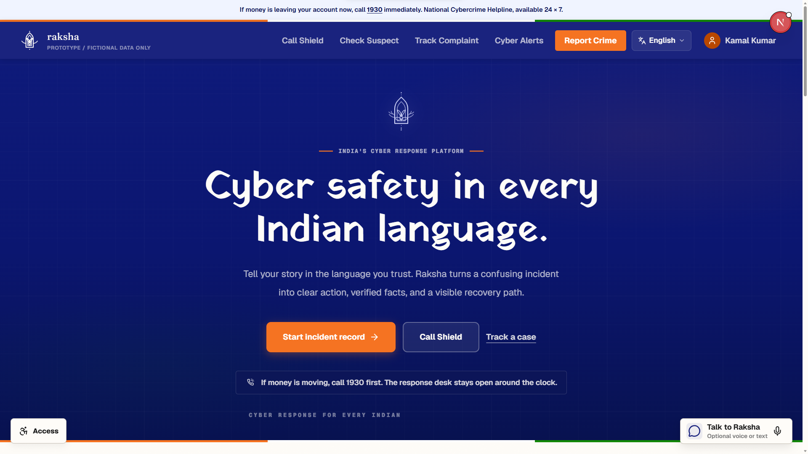

<div align="center">

# राक्षा · Raksha

**A trauma-informed cybercrime crisis platform for India**

*When seconds matter and the system feels too slow*

---


</div>

---

## The Problem

India's official cybercrime portal was designed for bureaucrats, not victims. When someone has just lost money to a digital arrest scam or a fake UPI collect request — panicked, confused, potentially still mid-scam — they're faced with a long, opaque form that asks them to recall details they don't have yet.

**Raksha** reimagines that experience from the ground up.

---

## What Raksha Does

You don't file a complaint. You take action.

The platform walks a cybercrime victim through four clear stages:

```
CHECK → ACT → REPORT → RECOVER
```

| Stage | What Happens |
|---|---|
| **Check** | Paste a suspicious message, link, UPI ID, or upload a screenshot. Raksha's Scam DNA engine identifies the fraud type and risk level in seconds. Check against crowdsourced identifier reports before you even engage. |
| **Act** | Get an immediate, ordered containment checklist — block the attacker, call your bank, dial the national 1930 helpline. Bank-specific playbooks with helpline numbers. Ranked by what's still reversible. |
| **Report** | A pre-filled complaint form built entirely from what you've already provided. Three recipient packets: NCRP/1930, bank nodal desk, and police. No asking the same question twice. |
| **Recover** | Statutory deadlines, an exportable evidence bundle, a downloadable complaint PDF, and a personalised recovery roadmap. |

Every step is designed for someone operating under stress. No jargon. No dead ends.

---

## Main Highlights

### Raksha Call Shield
Real-time scam phone-call detection and coaching. While the call is still happening, the platform listens (microphone or guided simulation) and scores the transcript against six scam scripts every four seconds. A radar UI lights up as markers are detected. An inline coach panel tells you exactly what to say — and what not to do — to end the call safely. A six-question dispatch desk then routes you to 112 (emergency), 1930 (financial fraud), or NCRP depending on your situation.

### Crowdsourced Identifier Intelligence
Every phone number, UPI ID, and URL that passes through the platform is counted. On the intake form, type a suspicious identifier and instantly see whether other users have already reported it — and when it was first seen. The more people use Raksha, the better the early-warning signal.

### Legal Document Generator
The platform generates a jurisdiction-appropriate PDF complaint draft from your incident record using `@react-pdf/renderer`. Pattern-specific templates select the correct authority addressee and complaint subject line (task scam, UPI fraud, investment fraud, identity theft, phishing, sextortion, romance scam). Download from your recovery page or your incident history at any time.

### Scam DNA Engine — GPT-4o
Two-layer analysis on every submission:
1. **Local pattern matcher** — a curated corpus of known Indian scam scripts. Zero latency, works offline, always available.
2. **GPT-4o multimodal analysis** — structured JSON: fraud type, stage, confidence score, behavioural signals, the single most important next move, and what *not* to do.

The local engine is the fallback — the platform is fully functional without any API key.

### Raksha Samvaad — Sarvam AI
A conversational safety agent powered by **Sarvam-M**, an Indian large language model. Responds in six languages — English, Hindi, Tamil, Telugu, Bengali, and Marathi. Supports voice input via the Web Speech API. Hardcoded to never ask for personal information and always surface the 1930 helpline for money emergencies.

### PII Redaction Layer
Before any content reaches an external AI, a local redaction pass strips Aadhaar numbers (checksum-validated), PAN, IFSC, UPI VPAs, phone numbers, bank account numbers, credit card numbers (Luhn-validated), emails, and URLs. Credential values (OTP, PIN, CVV, password in context) are stripped separately. What the model sees is already sanitised.

### Threat Atlas
A public, browsable library of all six recognised Indian cybercrime patterns — digital arrest, task scam, pig-butchering investment fraud, UPI collect fraud, sextortion, KYC/bank impersonation. Each pattern has a full stage timeline, signal list, next-move prediction, do-not list, and sourced official advisories.

### Operator Console
An analyst dashboard at `/operator` for case review. Shows extracted facts with source and confidence, risk signals, Call Shield session transcripts, local packets, event log, and a synthetic cluster illustration.

---

## Screenshots

 

 .png>)

 .png>)

.png>)

.png>)

.png>)

.png>) .png>) .png>)

---

## Tech Stack

| Layer | Technology |
|---|---|
| Framework | Next.js 16 (App Router), React 19, TypeScript 5 |
| Styling | Tailwind CSS v4, Class Variance Authority |
| AI — Analysis | OpenAI GPT-4o (multimodal), local pattern corpus |
| AI — Call Shield | OpenAI GPT-4o-mini, local keyword scorer (Hindi/English/Hinglish) |
| AI — Agent | Sarvam AI `sarvam-m` (Indian multilingual LLM) |
| TTS | Sarvam Bulbul v3 (in-browser audio), AWS Polly Kajal-Neural (phone call via Twilio) |
| State machine | XState v5 — the citizen journey is a formal finite state machine |
| Database | Neon serverless PostgreSQL via Drizzle ORM |
| Storage fallback | Atomic JSON file store (works without any DB credentials) |
| Auth | JWT (`jose`) + bcrypt password hashing |
| PDF generation | `@react-pdf/renderer` |
| Image hashing | `blockhash-core` (perceptual fingerprinting, client-side, no upload) |
| Validation | Zod |
| Charts | Recharts |
| Icons | Lucide React |

---

## Architecture Overview

The citizen journey is modelled as an XState finite state machine (`src/machines/journey.ts`). Each state — Check, Act, Report, Recover — has defined transitions, guards, and side effects. The app cannot skip steps, cannot show "Act" before "Check" is resolved, and handles error states explicitly.

The AI analysis route (`/api/analyze`) is the only server boundary the app crosses on the critical path. It receives sanitised content, runs the local pattern matcher first, optionally escalates to GPT-4o, records identifiers for crowdsource intelligence, and returns a typed `ScamAnalysis` object. Every downstream page — the playbook, the report form, the recovery guide — is derived from that single object.

```
User Input
    │
    ▼
PII Redaction (local)
    │
    ▼
Local Pattern Matcher ──── high confidence ──▶ ScamAnalysis + recordIdentifiers()
    │
    └── low confidence
          │
          ▼
       GPT-4o Multimodal
          │
          ▼
       ScamAnalysis
          │
    ┌─────┴──────┬──────────┬──────────┐
    ▼            ▼          ▼          ▼
 Playbook    Report     Clocks    Evidence
  (Act)      (Form)    (Recover)  (Bundle + PDF)
```

Call Shield runs a parallel path:

```
Phone call audio / microphone / text
    │
    ▼
shieldTranscriptWindow() → PII redaction
    │
    ▼
assessLocal() ── fallback ──▶ ShieldAssessment
    │
    └── (if API key) assessWithAI() [GPT-4o-mini, 6s timeout]
          │
          ▼
       Radar UI + Inline Coach
          │
          ▼
       buildBrief() → dispatch routing → /act/[id]
```

---

## Pages

| Route | Description |
|---|---|
| `/` | Homepage — multilingual hero, threat bulletin, journey timeline, Raksha Samvaad CTA |
| `/check` | Intake — paste text, voice, screenshot, identifier lookup, private image hash |
| `/check/[id]` | Scam DNA result — pattern, confidence, signals, recommended actions |
| `/shield` | Raksha Call Shield — real-time call detector, radar UI, inline coach, dispatch desk |
| `/act/[id]` | Immediate Action Board — bank-specific playbooks, credential steps, evidence checklist |
| `/report/[id]` | Packet preparation — three recipient packets, fact confirmation, mock submission |
| `/recover/[caseId]` | Recovery — Raksha ID, legal guidance clocks, PDF complaint download, evidence bundle |
| `/track` | Case tracker — enter any Raksha case ID to reopen a saved case |
| `/atlas` | Threat Atlas — index of all six scam patterns |
| `/atlas/[slug]` | Pattern detail — stage timeline, signals, aliases, do-not list, advisories |
| `/operator` | Operator console — all incidents with extracted facts, Shield transcripts, event logs |
| `/my-incidents` | Authenticated user's incident list with PDF download links |

---

## Running Locally

```bash
# Install dependencies
npm install

# Copy environment template
cp .env.example .env.local
# Add OPENAI_API_KEY and/or SARVAM_API_KEY for AI features
# Add DATABASE_URL for Neon persistence
# The app works fully without any keys via the local pattern matcher

# Start dev server
npm run dev
```

The public demo works without credentials via the local pattern matcher and a built-in synthetic incident `DEMO0001`. All pages are explorable at `/check/DEMO0001`, `/act/DEMO0001`, `/report/DEMO0001`, and `/recover/DEMO0001`.

---

## Deploy to Vercel

1. Import this repository in Vercel and set the **Root Directory** to `ncrp-reimagined`.
2. In Production, Preview, and Development, add `DATABASE_URL` and a unique `SESSION_SECRET` of at least 32 random bytes. `OPENAI_API_KEY` and `SARVAM_API_KEY` are optional.
3. From a trusted machine with the production `DATABASE_URL` set, run `npm run db:push` and then `npm run db:seed` from `ncrp-reimagined` once.
4. Vercel will build with `npm ci` followed by `npm run build`. Run `npm run verify` locally before deploying.

Do not deploy without `DATABASE_URL`: serverless instances do not provide durable local storage for accounts and incidents.

---

## Test Accounts

| Email | Password |
|---|---|
| test@email.com | Password@123 |
| user2@email.com | Password2@123 |

---

## Environment Variables

| Variable | Required | Purpose |
|---|---|---|
| `OPENAI_API_KEY` | Optional | GPT-4o scam analysis + GPT-4o-mini Call Shield assessment |
| `SARVAM_API_KEY` | Optional | Sarvam multilingual agent + Bulbul TTS audio alert |
| `DATABASE_URL` | Optional | Neon PostgreSQL persistence |
| `SESSION_SECRET` | Required in deployment | Auth cookie signing |
| `TWILIO_ACCOUNT_SID` | Optional | Twilio demo phone call alert |
| `TWILIO_AUTH_TOKEN` | Optional | Twilio demo phone call alert |
| `TWILIO_FROM_NUMBER` | Optional | Twilio caller ID |
| `ALERT_ALLOWLIST` | Optional | Comma-separated E.164 numbers permitted to receive demo calls |
| `DEMO_MODE` | Optional | Set `true` to enable Twilio phone-call path |

---

## Prototype Boundary

No real complaint, bank request, police queue, or platform report is submitted by this application. The legal document generator produces a prototype draft with no legal standing. Use synthetic information only. Raksha is not affiliated with any government body.

---

## Technical Details

<details>
<summary>API routes</summary>

| Route | Method | Purpose |
|---|---|---|
| `/api/analyze` | POST | Scam DNA analysis (local + GPT-4o), records crowdsource identifiers |
| `/api/agent` | POST | Raksha Samvaad multilingual chat (Sarvam `sarvam-m`) |
| `/api/shield/assess` | POST | Real-time call transcript assessment (GPT-4o-mini or local) |
| `/api/shield/save` | POST | Save completed Call Shield session as an incident |
| `/api/shield/alert` | POST | Spoken incident brief via Sarvam TTS (audio) or Twilio (phone) |
| `/api/identifier/lookup` | GET | Crowdsource lookup — prior reports for a phone/UPI/URL |
| `/api/incidents` | GET / POST | Incident CRUD |
| `/api/incidents/[id]` | GET / PATCH | Single incident operations; `?format=bundle` returns JSON export |
| `/api/incidents/[id]/document` | GET | Stream PDF complaint draft (`@react-pdf/renderer`) |
| `/api/auth/signin` | POST | JWT sign-in |
| `/api/auth/signup` | POST | Registration |
| `/api/auth/signout` | POST | Session teardown |
| `/api/auth/me` | GET | Current session |
| `/api/demo` | POST | Create a personal copy of DEMO0001 for the authenticated user |

</details>

<details>
<summary>Supported scam patterns</summary>

- Digital arrest / fake CBI/ED officer
- Task scam (YouTube likes, app reviews)
- Pig-butchering (fake investment / crypto)
- UPI collect fraud
- Sextortion / screen recording blackmail
- KYC/bank impersonation

</details>
