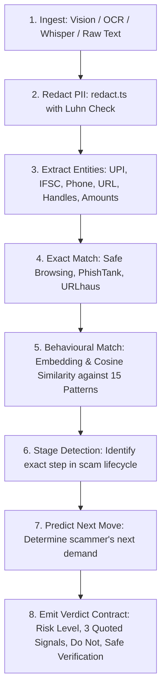
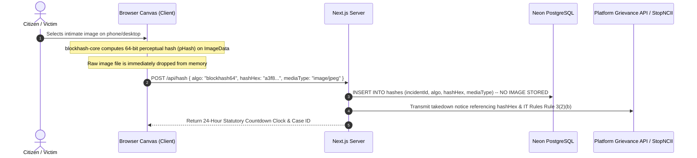

# ARCHITECTURE.md — System Architecture & Technical Specifications

## 1. High-Level Architecture (The 6 Layers)

The system is structured into 6 distinct, decoupled layers. Everything below the API layer is designed to be easily pluggable and testable.

```
+-----------------------------------------------------------------------------------+
| 1. CLIENT LAYER                                                                   |
| Next.js 15 (App Router), Tailwind CSS, XState Journey Machine,                   |
| In-Browser Perceptual Hashing (blockhash-core on HTML5 Canvas), Lucide Icons      |
+-----------------------------------------------------------------------------------+
                                         │
+-----------------------------------------------------------------------------------+
| 2. ROUTING LAYER (Citizen & Judge Pages)                                          |
| / (Home 4 Doors)    /check/[id] (DNA)     /triage/[id]       /act/[id] (Emergency)|
| /report/[id]        /recover/[caseId]     /documents/[id]    /atlas/[slug]        |
| /track              /help-someone         /login (Judge Auth)                     |
+-----------------------------------------------------------------------------------+
                                         │
+-----------------------------------------------------------------------------------+
| 3. API ENDPOINT LAYER (Next.js Route Handlers)                                    |
| /api/ingest         /api/dna              /api/hash          /api/incident/[id]   |
| /api/documents      /api/clocks           /api/atlas                              |
+-----------------------------------------------------------------------------------+
                                         │
+-----------------------------------------------------------------------------------+
| 4. INTELLIGENCE & PIPELINE LAYER                                                  |
| Vision OCR (GPT-4o) | Whisper STT | TypeScript PII Redaction (redact.ts)          |
| 15 Behavioral Pattern Graphs | Stage Detection | Next-Move Predictor               |
| In-Memory Cosine Similarity Matcher | Rule-Based Legal Document Formatter         |
+-----------------------------------------------------------------------------------+
                                         │
+-----------------------------------------------------------------------------------+
| 5. DATA & PERSISTENCE LAYER                                                       |
| Serverless PostgreSQL (Neon / Drizzle ORM) | Signed Cookie Sessions (jose)        |
| Strict Privacy Schema: NO media column in hashes table                            |
+-----------------------------------------------------------------------------------+
                     │                                   │
+------------------------------------+   +------------------------------------------+
| 6A. REAL EXTERNAL SERVICES         |   | 6B. MOCKED & LABELED SERVICES            |
| - Google Safe Browsing             |   | - 1930 / CFCFRMS Bank Freeze Simulation  |
| - PhishTank & URLhaus Feeds        |   | - StopNCII / Take It Down Handoff API    |
| - OpenAI Vision & Audio APIs       |   | - Grievance Appellate Committee (GAC)    |
|                                    |   | - MHA Money Restoration Module (MRM)     |
+------------------------------------+   +------------------------------------------+
```

---

## 2. Complete Application Route Map

| Route Path | Type | Purpose & Screen Functionality |
|---|---|---|
| `/` | Page | **Citizen Home**: Four Doors triage, universal check bar, quick stats ticker, Atlas preview strip. |
| `/check` | Page | **Intake Hub**: Multi-modal upload (screenshot, paste text/URL, phone/UPI identifier, voice note, guided prompt). |
| `/check/[id]` | Page | **Scam DNA Result**: High/Med/Unclear verdict, pattern confidence, 3 quoted signals, **Predicted Next Move**, do-not advice. |
| `/triage/[id]` | Page | **Harm Assessment**: "What have you already done?" branching questionnaire to determine active harm tracks. |
| `/act/[id]` | Page | **Immediate Action Mode**: Fullscreen emergency view (chrome hidden), sequenced checklists across Money, Content, Access, Identity, Safety. |
| `/report/[id]` | Page | **Prefilled Intake**: One-question-per-page reporting wizard preloaded with extracted entities from Stage 1. |
| `/report/[id]/review` | Page | **Check Your Answers**: Final summary review screen prior to submission. |
| `/report/[id]/submitted` | Page | **Case Confirmation**: 14-digit national acknowledgement number generation and next step routing. |
| `/recover/[caseId]` | Page | **Recovery Cockpit**: Live statutory countdown clocks, 1-click legal letters, plain-language status tracking, secondary evidence drop. |
| `/documents/[docId]/print` | Page | **Legal Print View**: Clean Print-CSS formatted legal notices (Bank Nodal Officer, Takedown, GAC Appeal, Ombudsman). |
| `/atlas` | Page | **Global Scam Pattern Atlas**: Searchable public library of active scam playbooks, red flags, and prevention strategies. |
| `/atlas/[slug]` | Page | **Pattern Deep Dive**: Interactive anatomy of a specific scam pattern with stage progression diagram and sample chat transcripts. |
| `/track` | Page | **Public Case Tracker**: 14-digit acknowledgement lookup with zero login required. |
| `/help-someone` | Page | **Assisted Reporting**: Specialized workflow for filing on behalf of elderly parents, minors, or family members. |
| `/login` | Page | **Demo / Judge Authentication**: Quick-login switchers for seeded evaluator profiles. |

---

## 3. The 8-Step Scam DNA Pipeline

When a user submits evidence (screenshot, text, audio, or identifier), the pipeline executes the following 8-step deterministic sequence:



### Pipeline Guarantees
1. **Redaction First**: Raw citizen PII (Aadhaar, PAN, Card numbers, Bank account details) is redacted in memory via `src/lib/redact.ts` **before** being passed to AI models or database logs.
2. **Never Output "Safe"**: Absence of an exact blacklist match evaluates to `Unclear` or `Medium Risk` (depending on linguistic heuristics), never `Safe`.

---

## 4. The Content Track Architecture (Zero-Upload Privacy)

The content track enforces that intimate images never leave the citizen's browser:



---

## 5. API Contracts & Specifications

### `POST /api/ingest`
- **Input**: `FormData` containing image file, audio file, or text string.
- **Process**: Runs Vision OCR / Whisper, redacts PII, extracts structured entities (UPI IDs, bank accounts, phones, URLs, amounts).
- **Output**:
  ```json
  {
    "rawRedactedText": "Received message from +91 98XXX XXXXX asking to complete YouTube like tasks...",
    "entities": {
      "phoneNumbers": ["+91 98765 43210"],
      "upiIds": ["merchantpay@okaxis"],
      "urls": ["http://fake-task-portal.xyz"],
      "amounts": [1500, 50000]
    }
  }
  ```

### `POST /api/dna`
- **Input**: Redacted narrative and extracted entities.
- **Process**: Exact blacklist checks + behavioral pattern classification + stage detection + next-move prediction.
- **Output**:
  ```json
  {
    "risk": "HIGH",
    "patternSlug": "part-time-task-scam",
    "patternName": "Prepaid Merchant Task Scam",
    "confidence": 0.94,
    "currentStage": "WITHDRAWAL_BLOCKED",
    "likelyNextMove": "They will demand a 30% GST or VIP unlocking deposit to release your frozen balance.",
    "quotedSignals": [
      "Pay Rs. 1,500 to unlock tier-2 tasks",
      "Account frozen due to irregular task completion",
      "Deposit refundable security fee to withdraw"
    ],
    "doNot": [
      "Do NOT pay any tax or unlocking fee — there is no final withdrawal step.",
      "Do NOT delete the Telegram chat history — it is essential evidence."
    ],
    "safeVerification": "Check official company recruitment pages directly; legitimate employers never demand prepaid merchant deposits."
  }
  ```

### `POST /api/documents`
- **Input**: `{ incidentId: string, documentType: "BANK_NODAL" | "TAKEDOWN_NOTICE" | "GAC_APPEAL" | "MRM_SHEET" | "OMBUDSMAN" }`
- **Process**: Hydrates verified legal template with incident entities and legal citations.
- **Output**: Structured JSON document payload ready for `/documents/[docId]/print`.

---

## 6. Architecture De-risking Decisions

| Tempting Complex Choice | What We Do Instead | Rationale & Time Saved |
|---|---|---|
| **Microsoft Presidio (Python Sidecar)** | Custom TypeScript PII module (`redact.ts`) with Luhn checks. | Presidio requires Python sidecar infrastructure. TypeScript module covers Aadhaar, PAN, UPI, cards, phones, IFSC in 130 lines. Saves 1+ day. |
| **PDQ compiled to WebAssembly** | `blockhash-core` pure JavaScript running on canvas. | The core requirement is proving the image never leaves the device. `blockhash-core` fulfills this natively without complex C/Wasm toolchains. Saves 1 day. |
| **pgvector Indexing** | In-memory cosine similarity across 15 pattern embeddings. | Corpus is 15 canonical scam patterns, not 15 million vectors. In-memory comparison is instantaneous (<5ms) and simplifies database setup. |
| **Heavy PDF Engine (Puppeteer/PDFKit)** | Native HTML `@media print` CSS templates. | Clean browser print stylesheets generate pixel-perfect legal documents instantly with zero backend rendering overhead. |
