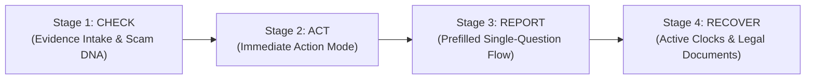
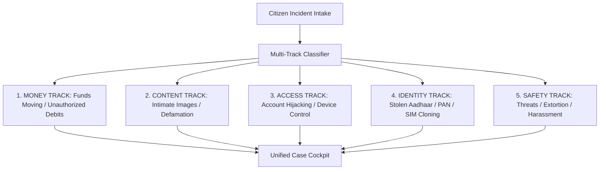

# DESIGN.md — Design System & User Experience Specification

## 1. Executive Summary & Design Thesis

India's existing National Cyber Crime Reporting Portal (`cybercrime.gov.in`) forces traumatized citizens through a rigid, bureaucratic obstacle course:
- Demands victims self-categorize into mutually exclusive silos (*Women/Children*, *Financial Fraud*, *Other Cyber Crime*).
- Enforces arbitrary 200-character minimums and restrictive character validations.
- Demands intimate image abuse victims upload their naked photos to government servers.
- Has zero awareness of critical statutory containment clocks (such as the RBI 3-day zero-liability window or the IT Rules 24-hour takedown mandate).

### The Reimagined Thesis
> **Contain the escape first, build the case second.**
> We replace criminal taxonomy with a **4-Door Triage**, **5 Parallel Harm Tracks**, an evidence-first **4-Stage Citizen Journey (Check → Act → Report → Recover)**, and client-side **hash-based privacy preserving reporting**.

---

## 2. The 4 Doors (No Legal Taxonomy)

The homepage completely eliminates legal and police jargon. It presents four doors aligned to the citizen's psychological state of mind:

```
+-----------------------------------------------------------------------------------+
|                                NCRP REIMAGINED                                    |
|             National Cyber Crime Reporting Portal · Built for the Citizen         |
+-----------------------------------------------------------------------------------+
|  [DOOR 1] Check if something is a scam       |  [DOOR 2] Something is happening    |
|  State: Not harmed yet                       |           right now                |
|  Action: 30 seconds, no login, instant DNA   |  State: Active threat / live call   |
+----------------------------------------------+------------------------------------+
|  [DOOR 3] I've already lost money, access    |  [DOOR 4] Track a report            |
|           or private content                 |  State: Filed already              |
|  State: Harm done, containment urgent        |  Action: 14-digit ACK lookup        |
+-----------------------------------------------------------------------------------+
|                         [GLOBAL SCAM ATLAS STRIP]                                 |
+-----------------------------------------------------------------------------------+
```

1. **Door 1: Check if something is a scam** — For suspicious SMS, WhatsApp offers, links, or calls. Fast intake, instant verdict.
2. **Door 2: Something is happening right now** — Active screen sharing, live sextortion threat, ongoing impersonation call. Immediate action mode.
3. **Door 3: I've already lost money, access or private content** — Funds debited, account locked, images weaponized. Enters containment and fast evidence intake.
4. **Door 4: Track a report** — Simple 14-digit acknowledgement lookup with plain-English/Hindi progress tracking and generated legal letters.

---

## 3. The 4-Stage Citizen Journey



### Stage 1: Check (Evidence-First Intake)
- **5 Ingestion Modes**:
  1. Upload screenshot (WhatsApp, SMS, Telegram, bank alert).
  2. Paste text / URL / message.
  3. Enter identifier (Phone number, UPI ID, Social handle, Bank Account).
  4. Voice description (Whisper transcription in English, Hindi, Hinglish).
  5. "I'm not sure what to upload" guided selector.
- **Scam DNA Verdict Card**:
  - Risk Level: `High Risk`, `Medium Risk`, or `Unclear` (**NEVER "Safe"**).
  - Pattern Name & Confidence Score (e.g. *Part-Time Task Scam, 94% match*).
  - 3 Exact Quoted Signals from user's input.
  - **Predicted Next Move**: *"They will now ask for an unlocking fee/tax to release your funds."*
  - "Do Not" Warnings: Actions that would worsen the situation.
  - Safe Verification: Independent verification steps without using scammer links.

### Stage 2: Act (Immediate Action Mode)
- When harm or high risk is confirmed, **all standard site chrome disappears**.
- The UI transforms into a distraction-free, urgent emergency checklist organized across 5 parallel tracks:
  1. **Money Track**: Direct bank freeze hotline, 1930 speed dial, transaction lock.
  2. **Content Track**: On-device perceptual hashing, 24-hour statutory takedown notices.
  3. **Access Track**: Session revocation, email account recovery, SIM swap audit (TAFCOP).
  4. **Identity Track**: Aadhaar biometric lock, credit report alert.
  5. **Safety Track**: Anonymous mode toggle, quick exit button, Tele-MANAS (14416) crisis line.
- **Governing Rule**: *Freeze before filing. Containment before paperwork.*

### Stage 3: Report (Prefilled, One-Question-Per-Page)
- Zero duplication: All entities, screenshots, dates, amounts, and handles extracted during Stage 1 are prefilled.
- Clean GOV.UK-inspired pattern: Single question per screen, clear progress indicators, back navigation, autosaving.
- Summary confirmation screen (*Check Your Answers*) before 1-click submission.
- Generates a **14-digit national acknowledgement number**.

### Stage 4: Recover (The Active Recovery Machine)
- Not a static status page. A dynamic recovery dashboard containing:
  - **Active Statutory Countdown Clocks**: Running live timers for legal rights.
  - **Generated Legal Documents**: Pre-filled letters ready to print/email (Bank Nodal Officer, GAC Appeal, Ombudsman, Takedown).
  - **Plain-Language Status Milestones**: What is happening, who has the ball, next expected action.
  - **Secondary Evidence Locker**: Add new transaction IDs, screenshots, or chat exports as they emerge.
  - **Fake Recovery Agent Shield**: Persistent alert warning victims against secondary recovery scammers.

---

## 4. The 5 Parallel Harm Tracks

A single cyber incident often spans multiple harm dimensions (e.g. Sextortion involves Money extortion, Content weaponization, and Physical/Psychological Safety). The portal runs all 5 tracks simultaneously:



---

## 5. Dignity & Safety Design Rules

| Design Rule | Implementation Specification |
|---|---|
| **Quick Exit Button** | Fixed floating button and `ESC` shortcut. Instantly redirects to `google.com` or `weather.com` and clears active form session storage. |
| **The Image Never Leaves the Device** | Intimate images are hashed locally via `blockhash-core` inside a client canvas. Zero bytes of the raw image reach the backend or database. |
| **Anonymous by Default** | Content, safety, and minor reporting tracks allow anonymous submissions with zero required PII. |
| **Age-Aware Routing** | Submissions indicating age < 18 automatically branch to POCSO compliance, NCMEC Take It Down handoff, and Childline 1098. |
| **Do-No-Harm Sextortion Defaults** | Clear hero warnings: *Do NOT pay (they will ask for more)*, *Do NOT delete chats (needed for police evidence)*, *Do NOT engage further*. |
| **Tele-MANAS Integration** | Toll-free 24/7 mental health crisis helpline `14416` prominently rendered on all distress pathways. |
| **Trauma-Informed Form Copy** | No minimum character counts (replaces old 200-char barrier), tolerant of punctuation/special characters, conversational Indian English and Hindi. |
| **Demo Ethics Standard** | All demo screenshots use clearly synthetic mock media (e.g. scenic landscape labeled as synthetic placeholder). |

---

## 6. Core Component Specifications

### 1. `QuickExit.tsx`
- **Location**: Top right header & sticky mobile bottom.
- **Behavior**: Single-click or double-press `ESC`. Clears temporary journey state, replaces history state, immediately navigates to `https://www.google.com`.

### 2. `EvidenceDrop.tsx`
- Multi-modal drop zone supporting drag-and-drop images, clipboard paste (`Ctrl+V`), text snippet entry, and audio voice recording.
- Instant client-side PII masking preview and perceptual hash computation badge.

### 3. `RiskVerdict.tsx`
- Displays risk badge: `High Risk` (Crimson), `Medium Risk` (Amber), `Unclear Pattern` (Slate).
- Shows pattern name, confidence percentage bar, 3 extracted quoted signals from citizen input, and the **Likely Next Move** alert box.

### 4. `ClockCard.tsx`
- Interactive countdown card for statutory deadlines.
- Shows time remaining, statutory source (e.g. *IT Rules 2021 Rule 3(2)(b)*), legal right explanation, and a 1-click **"Download Pre-Filled Letter"** button.

### 5. `ActionStep.tsx`
- Clean checklist item with numbered step, urgency badge (e.g. *Immediate*, *Within 2 Hours*), direct action trigger (e.g. Call 1930, Lock SIM, Revoke Sessions), and status checkbox.

### 6. `StageTimeline.tsx`
- Horizontal breadcrumb / stepper indicating current position: **1. Check → 2. Act → 3. Report → 4. Recover**.
- Allows jumping back to review previously entered evidence without resetting downstream data.

---

## 7. Design Tokens & Visual Hierarchy

- **Color Palette**:
  - `Background`: Deep slate dark mode (`#0B0F19`) with crisp high-contrast cards (`#161E2E`) or clean government paper mode (`#F8FAFC`).
  - `Primary / Trust`: India Blue / Indigo (`#1E40AF` / `#3B82F6`).
  - `Emergency / High Risk`: Crimson (`#DC2626` / `#EF4444`).
  - `Warning / Clock Active`: Amber (`#D97706` / `#F59E0B`).
  - `Success / Contained`: Emerald (`#059669` / `#10B981`).
- **Typography**:
  - Primary Font: Inter / System Sans.
  - Monospace Font: JetBrains Mono / Geist Mono (for Hashes, IFSC, Transaction IDs, Acknowledgement numbers).
- **Responsive Layout**:
  - Mobile-first (360px - 430px smartphone viewports prioritized, where 80%+ of cyber fraud victims access portals).
  - Clean touch targets (minimum 48px height for all interactive buttons and inputs).
