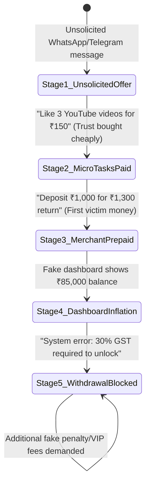
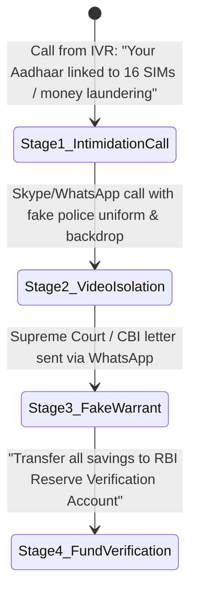

# SCAM_DNA.md — Scam DNA Behavioral Pattern Engine & PII Redactor

## 1. Engine Core Philosophy

> **Identifiers rotate hourly. The behavioral script does not.**
> Scammers cycle through burner phone numbers, mule UPI IDs, and newly registered domains in minutes. A database lookup against known blacklists will always be blind to brand-new victims.
> **Scam DNA matches the psychological and operational playbook.** This enables NCRP Reimagined to identify zero-day campaigns and accurately predict the scammer's next move.

---

## 2. PII Redaction Specification (`src/lib/redact.ts`)

Before any user input (screenshot OCR text, audio transcript, or pasted narrative) is sent to an LLM or stored in the database, it passes through `redact.ts`.

### Regex & Validation Matrix

| Target Entity | Pattern / Regex Rule | Validation / Algorithmic Check | Redacted Token |
|---|---|---|---|
| **Aadhaar Number** | `\b[2-9]\d{3}\s?\d{4}\s?\d{4}\b` | 12 digits, non-zero starting digit | `[AADHAAR_REDACTED]` |
| **PAN Number** | `\b[A-Z]{5}[0-9]{4}[A-Z]\b` | 5 letters + 4 digits + 1 letter | `[PAN_REDACTED]` |
| **Credit / Debit Cards** | `\b(?:\d{4}[-\s]?){3}\d{4}\b` | Luhn Mod-10 algorithm check | `[CARD_REDACTED]` |
| **Indian Mobile Numbers**| `(?:\+91[\s-]?)?[6-9]\d{9}\b` | 10 digits starting with 6, 7, 8, or 9 | `[PHONE_REDACTED]` |
| **UPI Identifiers** | `\b[a-zA-Z0-9.\-_]{2,256}@[a-zA-Z]{2,64}\b` | Bank handle extraction (e.g. `@okaxis`, `@ybl`) | `[UPI_REDACTED]` |
| **Bank IFSC Code** | `\b[A-Z]{4}0[A-Z0-9]{6}\b` | 4th char is `0`, 11 alphanumeric characters | `[IFSC_REDACTED]` |

---

## 3. The 15 Canonical Scam Behavioral Patterns

```
+--------------------------------------------------------------------------------------------------------------------+
| ID  | PATTERN NAME                       | PRIMARY TRIGGER / VECTOR    | CRITICAL HARMS       | SCRIPT LENGTH      |
+-----+------------------------------------+-----------------------------+----------------------+--------------------+
| 01  | Part-Time Task / Merchant Scam     | Telegram/WhatsApp job offer | Money                | 5 Stages           |
| 02  | Digital Arrest / Law Enforcement   | Fake CBI/Police video call  | Money, Safety        | 4 Stages           |
| 03  | Sextortion / Video Call Trap       | WhatsApp video call record  | Content, Safety, $$  | 4 Stages           |
| 04  | Electricity Bill Disconnection     | Urgent SMS power cut alert  | Money, Access        | 3 Stages           |
| 05  | Instant Fake Loan App Extortion    | Malicious APK / Contact sync| Access, Safety, $$   | 4 Stages           |
| 06  | Fake Courier / Illegal Parcel      | Fake FedEx / Customs alert  | Money, Identity      | 4 Stages           |
| 07  | Fake Crypto / High-Return Trading  | Stock tips group / Fake web | Money                | 5 Stages           |
| 08  | Bank KYC / PAN Card Suspension     | Phishing SMS / Fake portal  | Money, Identity      | 3 Stages           |
| 09  | Remote Access Takeover             | AnyDesk/TeamViewer install  | Access, Money        | 3 Stages           |
| 10  | Romance / Matrimonial Trap         | Shaadi/Tinder relationship  | Money, Identity      | 4 Stages           |
| 11  | Work-From-Home Data Entry Trap     | False agreement penalty     | Money, Safety        | 3 Stages           |
| 12  | Social Media Account Takeover      | Friend in distress message  | Access, Money        | 3 Stages           |
| 13  | Search Engine Customer Care Trap   | Spoofed Google Search ads   | Money, Access        | 3 Stages           |
| 14  | SIM Swap / 5G eSIM Deactivation    | Telephony upgrade prompt    | Access, Identity     | 3 Stages           |
| 15  | KBC Lottery / Lucky Draw Voucher   | WhatsApp audio note reward  | Money                | 3 Stages           |
+--------------------------------------------------------------------------------------------------------------------+
```

---

## 4. Deep Dives into High-Prevalence Patterns

### Pattern 01: Part-Time Task / Merchant Prepaid Scam (`part-time-task-scam`)

- **Next-Move Prediction**:
  - *If at Stage 3*: Scammer will invite user to a "VIP Telegram Group" and prompt for ₹10,000+ deposit.
  - *If at Stage 4/5*: Scammer will claim account is frozen due to credit score/tax reasons and demand a "last unlocking fee".

---

### Pattern 02: Digital Arrest / CBI-Police Impersonation (`digital-arrest`)

- **Next-Move Prediction**:
  - *If at Stage 2/3*: Scammer will demand the victim stay on continuous video call and not speak to family ("Digital Custody").
  - *If at Stage 4*: Scammer will promise funds will be refunded within 15 minutes of "verification".

---

### Pattern 03: Sextortion / Video Call Blackmail (`sextortion-blackmail`)

```mermaid
stateDiagram-v2
    [*] --> Stage1_ContactLure: Friendly stranger initiates casual video chat on WhatsApp/Instagram
    Stage1_ContactLure --> Stage2_ScreenCapture: Scammer streams explicit prerecorded video; records victim's face
    Stage2_ScreenCapture --> Stage3_ExtortionDemand: Sends screen recording & list of victim's social followers
    Stage3_ExtortionDemand --> Stage4_Escalation: Demands immediate UPI payment or threats of viral leak
```

- **Next-Move Prediction**:
  - *If at Stage 3*: If victim pays ₹5,000, scammer will immediately demand ₹20,000 for "deleting YouTube server backup".
- **Safety Overrides**:
  - Automatically activate **Content Track**, **Quick Exit**, **Zero-Upload Perceptual Hashing**, and **Tele-MANAS (14416)** crisis support.

---

## 5. Next-Move Prediction Contract

The output generated by the engine must adhere to the strict JSON verdict contract:

```typescript
export interface ScamVerdictContract {
  risk: 'HIGH' | 'MEDIUM' | 'UNCLEAR'; // NEVER 'SAFE'
  patternSlug: string;
  patternName: string;
  confidence: number; // 0.00 to 1.00
  currentStageId: string;
  currentStageName: string;
  likelyNextMove: string; // The single most probable next scammer action
  quotedSignals: [string, string, string]; // 3 exact quoted snippets from user evidence
  doNot: string[]; // Urgent negative instructions (prevent worsening)
  safeVerification: string; // Independent out-of-band verification guidance
}
```
