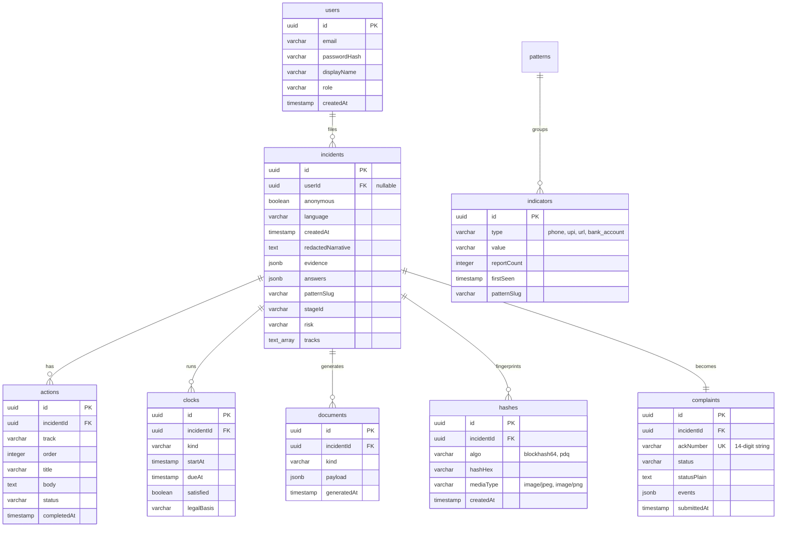

# SCHEMA.md — Database Schema & Data Dictionary

## 1. Database Architecture & Technology

- **Database Engine**: Serverless PostgreSQL (Neon / Supabase)
- **ORM**: Drizzle ORM (`drizzle-orm`, `drizzle-kit`)
- **Core Principle**: *The incident is the spine. Everything else hangs off it.*
- **Strict Privacy Rule**: The `hashes` table stores cryptographic/perceptual hashes and metadata only. **There is NO binary or media storage column in the database.**

---

## 2. Entity-Relationship Diagram



---

## 3. Table Definitions & Column Specifications

### 3.1. `users`
Stores user and mock judge accounts.
| Column | Type | Constraints | Description |
|---|---|---|---|
| `id` | `UUID` | Primary Key, Default `gen_random_uuid()` | Unique user identifier |
| `email` | `VARCHAR(255)` | Unique, Not Null | User login email |
| `passwordHash` | `VARCHAR(255)` | Not Null | Bcrypt / PBKDF2 hash |
| `displayName` | `VARCHAR(255)` | Not Null | User's display name |
| `role` | `VARCHAR(50)` | Default `'citizen'` | `'citizen'`, `'judge'`, `'investigator_mock'` |
| `createdAt` | `TIMESTAMP WITH TIME ZONE` | Default `now()` | Account creation time |

### 3.2. `incidents`
The central spinal entity representing an intake through Check, Act, Report, and Recover.
| Column | Type | Constraints | Description |
|---|---|---|---|
| `id` | `UUID` | Primary Key, Default `gen_random_uuid()` | Unique incident ID |
| `userId` | `UUID` | Nullable, Foreign Key → `users.id` | Associated user if authenticated |
| `anonymous` | `BOOLEAN` | Default `false` | If true, strips all submitter identity data |
| `language` | `VARCHAR(10)` | Default `'en'` | Preferred language (`'en'`, `'hi'`, `'hinglish'`) |
| `createdAt` | `TIMESTAMP WITH TIME ZONE` | Default `now()` | Intake initiation timestamp |
| `redactedNarrative`| `TEXT` | Nullable | PII-sanitized citizen description |
| `evidence` | `JSONB` | Default `'{}'` | Structured JSON of extracted entities & raw inputs |
| `answers` | `JSONB` | Default `'{}'` | Key-value answers from triage & reporting forms |
| `patternSlug` | `VARCHAR(100)`| Nullable | Matched scam pattern ID (e.g. `'part-time-task-scam'`) |
| `stageId` | `VARCHAR(100)`| Nullable | Current stage within pattern lifecycle |
| `risk` | `VARCHAR(20)` | Default `'UNCLEAR'` | `'HIGH'`, `'MEDIUM'`, `'UNCLEAR'` (Never `'SAFE'`) |
| `tracks` | `TEXT[]` | Default `ARRAY['money']` | Active harm tracks: `['money', 'content', 'access', 'identity', 'safety']` |

### 3.3. `actions`
Ordered checklist items for the **Immediate Action Mode** (Stage 2).
| Column | Type | Constraints | Description |
|---|---|---|---|
| `id` | `UUID` | Primary Key, Default `gen_random_uuid()` | Action step ID |
| `incidentId` | `UUID` | Foreign Key → `incidents.id`, Not Null | Owning incident |
| `track` | `VARCHAR(50)` | Not Null | Harm track (`'money'`, `'content'`, `'access'`, etc.) |
| `order` | `INTEGER` | Not Null | Display sequence index |
| `title` | `VARCHAR(255)`| Not Null | Concise action heading (e.g. *"Call 1930 Helpline"*) |
| `body` | `TEXT` | Not Null | Step-by-step guidance instructions |
| `status` | `VARCHAR(50)` | Default `'PENDING'` | `'PENDING'`, `'COMPLETED'`, `'SKIPPED'` |
| `completedAt` | `TIMESTAMP WITH TIME ZONE` | Nullable | Completion timestamp |

### 3.4. `clocks`
Active statutory countdown deadlines.
| Column | Type | Constraints | Description |
|---|---|---|---|
| `id` | `UUID` | Primary Key, Default `gen_random_uuid()` | Clock instance ID |
| `incidentId` | `UUID` | Foreign Key → `incidents.id`, Not Null | Owning incident |
| `kind` | `VARCHAR(50)` | Not Null | Clock type identifier (e.g. `'RBI_ZERO_LIABILITY'`, `'IT_RULES_TAKEDOWN'`) |
| `startAt` | `TIMESTAMP WITH TIME ZONE` | Not Null | When the legal trigger occurred / notification sent |
| `dueAt` | `TIMESTAMP WITH TIME ZONE` | Not Null | Statutory expiration timestamp |
| `satisfied` | `BOOLEAN` | Default `false` | True when institution fulfills requirement |
| `legalBasis` | `VARCHAR(255)`| Not Null | Legal source string rendered to user |

### 3.5. `documents`
Pre-filled legal documents, notices, and formal complaints generated from incident state.
| Column | Type | Constraints | Description |
|---|---|---|---|
| `id` | `UUID` | Primary Key, Default `gen_random_uuid()` | Document ID |
| `incidentId` | `UUID` | Foreign Key → `incidents.id`, Not Null | Associated incident |
| `kind` | `VARCHAR(50)` | Not Null | `'BANK_NODAL_LETTER'`, `'TAKEDOWN_NOTICE'`, `'GAC_APPEAL'`, `'MRM_DATA_SHEET'`, `'OMBUDSMAN_COMPLAINT'` |
| `payload` | `JSONB` | Not Null | Populated document field values (recipient, IFSC, amounts, legal clauses) |
| `generatedAt` | `TIMESTAMP WITH TIME ZONE` | Default `now()` | Generation timestamp |

### 3.6. `complaints`
The official complaint submission record.
| Column | Type | Constraints | Description |
|---|---|---|---|
| `id` | `UUID` | Primary Key, Default `gen_random_uuid()` | Complaint record ID |
| `incidentId` | `UUID` | Unique, Foreign Key → `incidents.id` | Owning incident |
| `ackNumber` | `VARCHAR(14)` | Unique, Not Null | 14-digit national acknowledgement number (e.g. `20260823019842`) |
| `status` | `VARCHAR(50)` | Default `'SUBMITTED'` | `'SUBMITTED'`, `'UNDER_REVIEW'`, `'FREEZE_INITIATED'`, `'RESOLVED'` |
| `statusPlain` | `TEXT` | Not Null | Plain-language citizen explanation of current status |
| `events` | `JSONB` | Default `'[]'` | Audit trail log of case milestone events |
| `submittedAt` | `TIMESTAMP WITH TIME ZONE` | Default `now()` | Formal submission timestamp |

### 3.7. `hashes`
Privacy-preserving perceptual and cryptographic image hashes.
| Column | Type | Constraints | Description |
|---|---|---|---|
| `id` | `UUID` | Primary Key, Default `gen_random_uuid()` | Hash ID |
| `incidentId` | `UUID` | Foreign Key → `incidents.id`, Not Null | Owning incident |
| `algo` | `VARCHAR(50)` | Default `'blockhash64'` | Hashing algorithm (`'blockhash64'`, `'pdq'`) |
| `hashHex` | `VARCHAR(128)`| Not Null | Hexadecimal perceptual hash fingerprint |
| `mediaType` | `VARCHAR(50)` | Not Null | Original file MIME type (`'image/jpeg'`, `'image/png'`) |
| `createdAt` | `TIMESTAMP WITH TIME ZONE` | Default `now()` | Hash calculation timestamp |

---

## 4. Drizzle ORM Schema Definitions (TypeScript Preview)

```typescript
import { pgTable, uuid, varchar, text, boolean, timestamp, integer, jsonb } from 'drizzle-orm/pg-core';

export const incidents = pgTable('incidents', {
  id: uuid('id').defaultRandom().primaryKey(),
  userId: uuid('user_id'),
  anonymous: boolean('anonymous').default(false).notNull(),
  language: varchar('language', { length: 10 }).default('en').notNull(),
  createdAt: timestamp('created_at', { withTimezone: true }).defaultNow().notNull(),
  redactedNarrative: text('redacted_narrative'),
  evidence: jsonb('evidence').default({}),
  answers: jsonb('answers').default({}),
  patternSlug: varchar('pattern_slug', { length: 100 }),
  stageId: varchar('stage_id', { length: 100 }),
  risk: varchar('risk', { length: 20 }).default('UNCLEAR').notNull(),
  tracks: text('tracks').array().default(['money']),
});

export const hashes = pgTable('hashes', {
  id: uuid('id').defaultRandom().primaryKey(),
  incidentId: uuid('incident_id').references(() => incidents.id).notNull(),
  algo: varchar('algo', { length: 50 }).default('blockhash64').notNull(),
  hashHex: varchar('hash_hex', { length: 128 }).notNull(),
  mediaType: varchar('media_type', { length: 50 }).notNull(),
  createdAt: timestamp('created_at', { withTimezone: true }).defaultNow().notNull(),
});
```
